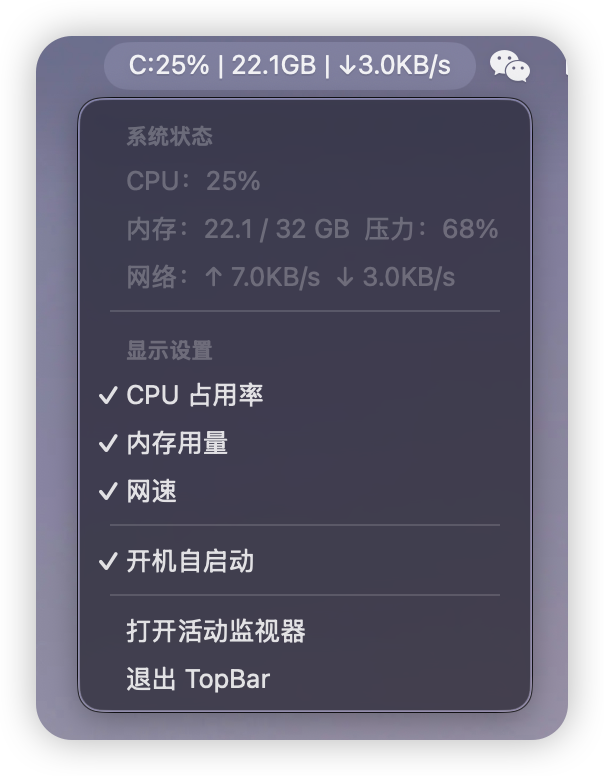

# 🚀 TopBar

**TopBar** 是一款专为 macOS 设计的极简、高精度菜单栏系统监控工具。它使用原生 SwiftUI 构建，旨在提供最轻量、最准确的硬件状态实时反馈。

[](LICENSE)
[](https://github.com/zspzhong/TopBar/releases)
[](https://www.apple.com/macos/)

---

## ✨ 核心亮点

### 💎 实验室级内存监测 (Memory Precision)
市面上大多监控工具数值偏差巨大，TopBar 深入 macOS 内核，采用与系统原生**“活动监视器”**完全一致的计算公式：
> **已用内存 = 内部内存 (Internal) + 联动内存 (Wired) + 压缩器 (Compressor)**
> 
拒绝虚假数据，给你最真实、最硬核的系统占用反馈。

### 🏎️ 实时网络与 CPU 监测
- **网络流：** 精确抓取网络接口数据，支持实时显示上传与下载速率。
- **CPU：** 毫秒级更新频率，一眼看穿后台进程消耗。

### 🎨 纯正的原生体验
- **SwiftUI 驱动：** 运行内存占用极低（< 20MB），几乎不消耗系统资源。
- **完美适配：** 原生支持 macOS 14+ 视觉风格及动态深色模式。
- **交互简洁：** 支持在下拉菜单中一键勾选/隐藏监控项。

---

## 📸 预览图



---

## 📥 如何安装与使用

### 方法 1：手动安装 (推荐)
1. 前往 [Releases](https://github.com/zspzhong/TopBar/releases) 页面。
2. 下载最新的 `TopBar.zip` 并解压。
3. 将 `TopBar.app` 拖入你的 **应用程序 (Applications)** 文件夹。

> [!TIP]
> **初次启动权限说明**：由于未经过 Apple 官方公证，首次打开请 **右键点击 -> 选择“打开”**，在弹窗中再次点击“打开”即可正常运行。

### 方法 2：Homebrew (即将上线)
```bash
brew install --cask zspzhong/tap/topbar